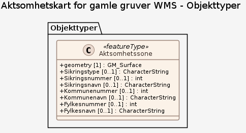

# Produktspesifikasjon: Aktsomhetskart for gamle gruver WMS

## Generelt om spesifikasjonen

### Unik identifisering

424ae763-1a82-4c2a-aaa7-e90ed5dc30ec

#### Fullstendig navn

Aktsomhetskart for gamle gruver WMS

### Ansvarlig organisasjon

Direktoratet for mineralforvaltning

### Hovedtema

Gruvedrift, Mineralressurs, Aktsomhetskart, Gruve, DMF, dirmin, Norge fastland, Arealbruk, Geologi, Menneskers helse og sikkerhet, Mineralressurser, Rapporteringsenheter og områder med særlig forvaltning eller restriksjoner

### Sammendrag

Tjenesten viser stedfestete objekter relatert til nedlagt gruvedrift fra ulike kilder og indikerer områder som krever spesiell aktsomhet. Aktsomhetskartet inneholder data fra Direktoratet for mineralforvaltning (DMF) sitt interne gruvesikringsregister og fra en ekstern kilde (Statskog), og viser blant annet gruver, gruveåpninger og sikringer samt aktsomhetssoner knyttet til disse.

DMF sitt interne gruvesikringsregister inneholder objekter der staten ved DMF har utført befaring på gamle nedlagte gruver, og inneholder ikke gruveområder der andre har hatt oppfølging, som for eksempel Statskog. Aktsomhetssonene knyttet til interne data er et polygon strukket 50 meter utenfor alle objekter knyttet til én bestemt gruve.

Kartlaget for eksterne data inneholder aktuelle punkter fra Kartverket sin M711-serie, der noen er registrert som en gruve. Det er lagt inn en 200 meter aktsomhetssone rundt disse punktene.

Vennligst bruk "KONTAKT OSS"-skjemaet på <https://minit.dirmin.no/kart> hvis du/dere ønsker å gi oss tilbakemeldinger knyttet til registreringene.

### Formål

Spatial planning, education, outdoor activities

## Spesifikasjonsomfang

**Nivå**: service

**Utstrekning**:

- **romlig**:
  - **bbox**: 2.0, 57.0, 33.0, 72.0
  - **avgrensning**:
    - **vest**: 2.0
    - **sør**: 57.0
    - **øst**: 33.0
    - **nord**: 72.0

**Juridiske begrensninger**:

- **Tilgangsbegrensninger**: Åpne data
- **Bruksbegrensninger**: Lisens
- **Lisens**: Norsk lisens for offentlige data (NLOD)
- **Lisenslenke**: <http://data.norge.no/nlod/no/1.0>
- **Sikkerhetsbegrensninger**: Ugradert

## Innhold og struktur

**Bruk**: Arealplanlegging, undervisning, ferdsel i skog og mark

### Datamodell

#### Aktsomhetssone

Geometri: Type: GM_Surface Koordinatreferansesystem (crs): • <a href="http://www.opengis.net/def/crs/OGC/1.3/CRS84"><http://www.opengis.net/def/crs/OGC/1.3/CRS84></a> • <a href="http://www.opengis.net/def/crs/EPSG/0/25833"><http://www.opengis.net/def/crs/EPSG/0/25833></a> • <a href="http://www.opengis.net/def/crs/EPSG/0/32633"><http://www.opengis.net/def/crs/EPSG/0/32633></a> • <a href="http://www.opengis.net/def/crs/EPSG/0/4326"><http://www.opengis.net/def/crs/EPSG/0/4326></a> • <a href="http://www.opengis.net/def/crs/EPSG/0/3857"><http://www.opengis.net/def/crs/EPSG/0/3857></a>

Egenskaper

<table class="feature-attribute-table">
  <colgroup>
    <col style="width: 35%;" />
    <col style="width: 65%;" />
  </colgroup>
  <tbody>
    <tr>
      <th scope="row">Navn:</th>
      <td><strong>geometry</strong></td>
    </tr>
    <tr>
      <th scope="row">Type:</th>
      <td>GM_Surface</td>
    </tr>
  </tbody>
</table>

<table class="feature-attribute-table">
  <colgroup>
    <col style="width: 35%;" />
    <col style="width: 65%;" />
  </colgroup>
  <tbody>
    <tr>
      <th scope="row">Navn:</th>
      <td><strong>Sikringstype</strong></td>
    </tr>
    <tr>
      <th scope="row">Multiplisitet:</th>
      <td>0..1</td>
    </tr>
    <tr>
      <th scope="row">Type:</th>
      <td>string</td>
    </tr>
  </tbody>
</table>

<table class="feature-attribute-table">
  <colgroup>
    <col style="width: 35%;" />
    <col style="width: 65%;" />
  </colgroup>
  <tbody>
    <tr>
      <th scope="row">Navn:</th>
      <td><strong>Sikringsnummer</strong></td>
    </tr>
    <tr>
      <th scope="row">Multiplisitet:</th>
      <td>0..1</td>
    </tr>
    <tr>
      <th scope="row">Type:</th>
      <td>int</td>
    </tr>
  </tbody>
</table>

<table class="feature-attribute-table">
  <colgroup>
    <col style="width: 35%;" />
    <col style="width: 65%;" />
  </colgroup>
  <tbody>
    <tr>
      <th scope="row">Navn:</th>
      <td><strong>Sikringsnavn</strong></td>
    </tr>
    <tr>
      <th scope="row">Multiplisitet:</th>
      <td>0..1</td>
    </tr>
    <tr>
      <th scope="row">Type:</th>
      <td>string</td>
    </tr>
  </tbody>
</table>

<table class="feature-attribute-table">
  <colgroup>
    <col style="width: 35%;" />
    <col style="width: 65%;" />
  </colgroup>
  <tbody>
    <tr>
      <th scope="row">Navn:</th>
      <td><strong>Kommunenummer</strong></td>
    </tr>
    <tr>
      <th scope="row">Multiplisitet:</th>
      <td>0..1</td>
    </tr>
    <tr>
      <th scope="row">Type:</th>
      <td>int</td>
    </tr>
  </tbody>
</table>

<table class="feature-attribute-table">
  <colgroup>
    <col style="width: 35%;" />
    <col style="width: 65%;" />
  </colgroup>
  <tbody>
    <tr>
      <th scope="row">Navn:</th>
      <td><strong>Kommunenavn</strong></td>
    </tr>
    <tr>
      <th scope="row">Multiplisitet:</th>
      <td>0..1</td>
    </tr>
    <tr>
      <th scope="row">Type:</th>
      <td>string</td>
    </tr>
  </tbody>
</table>

<table class="feature-attribute-table">
  <colgroup>
    <col style="width: 35%;" />
    <col style="width: 65%;" />
  </colgroup>
  <tbody>
    <tr>
      <th scope="row">Navn:</th>
      <td><strong>Fylkesnummer</strong></td>
    </tr>
    <tr>
      <th scope="row">Multiplisitet:</th>
      <td>0..1</td>
    </tr>
    <tr>
      <th scope="row">Type:</th>
      <td>int</td>
    </tr>
  </tbody>
</table>

<table class="feature-attribute-table">
  <colgroup>
    <col style="width: 35%;" />
    <col style="width: 65%;" />
  </colgroup>
  <tbody>
    <tr>
      <th scope="row">Navn:</th>
      <td><strong>Fylkesnavn</strong></td>
    </tr>
    <tr>
      <th scope="row">Multiplisitet:</th>
      <td>0..1</td>
    </tr>
    <tr>
      <th scope="row">Type:</th>
      <td>string</td>
    </tr>
  </tbody>
</table>

## Kvalitet

**Nivå**: service

## Datavedlikehold

**Vedlikeholdsfrekvens**: Etter behov

**Vedlikeholdsnotat**: Arealplanlegging, undervisning, ferdsel i skog og mark

## Leveranse

**Distribusjoner**:

- **format**: - **format**: OGC:WMS
  **tilgang**:

  - **lenke**: <https://kart.dirmin.no/dirmin/services/GruvesikringsregisterBeta/MapServer/WmsServer?request=GetCapabilities&service=WMS>
  - **protokoll**: OGC:WMS

- **tittel**: WMS-tjeneste
  **format**: - **format**: WMS-tjeneste
  **tilgang**:

  - **lenke**: <https://kart.dirmin.no/dirmin/services/GruvesikringsregisterBeta/MapServer/WmsServer?request=GetCapabilities&service=WMS>
  - **protokoll**: OGC:WMS

## Metadata

**Standard**: ISO19115

**Standardversjon**: 2003

**Metadatadato**: 2021-06-02

**språk**: nor

**Kontaktpunkt**:

- **organisasjon**: Direktoratet for mineralforvaltning
- **epost**: post@dirmin.no
- **rolle**: pointOfContact

**Identifikatorer**:

- **Utsteder**: geonorge
  **kode**: 424ae763-1a82-4c2a-aaa7-e90ed5dc30ec

**Metadatalenke**:
<https://www.geonorge.no/geonetwork/srv/nor/csw?service=CSW&request=GetRecordById&version=2.0.2&outputSchema=http://www.isotc211.org/2005/gmd&elementSetName=full&id=424ae763-1a82-4c2a-aaa7-e90ed5dc30ec>
