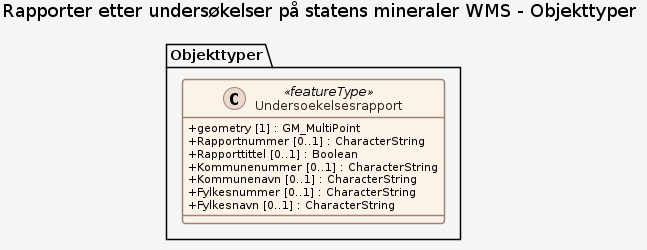

# Produktspesifikasjon: Rapporter etter undersøkelser på statens mineraler WMS

## Generelt om spesifikasjonen

### Unik identifisering

3f59e82c-217b-4092-a1dc-6327a9c3bfbf

#### Fullstendig navn

Rapporter etter undersøkelser på statens mineraler WMS

#### Versjon

2018-04-27

### Ansvarlig organisasjon

Direktoratet for mineralforvaltning

### Hovedtema

Statens mineraler, Bergrettigheter, Mineralogi, Petrologi, Geofysikk, Geokjemi, Prospektering, Leting, Undersøkelser, Mineral, Norge fastland, Geologi, Mineralressurser, DMF, dirmin

### Sammendrag

Rapporter etter undersøkelser på statens mineraler er rapportering av utførte undersøkelsesarbeider innenfor et område med undersøkelsesrettigheter. Dette kan være geologiske og geofysiske arbeider som er utført av rettighetshavere.

Tjenesten viser undersøkelsesrapporter som Direktoratet for mineralforvaltning (DMF) har mottatt, basert på rettigheter gitt etter mineralloven, og som er digitalt stedfestet (punkt) og godkjent.

Vennligst bruk "KONTAKT OSS"-skjemaet på <https://minit.dirmin.no/kart> hvis du/dere ønsker å gi oss tilbakemeldinger knyttet til registreringene.

### Formål

The mineral rights reports give an overview over the exploration work performed in areas with mineral rights in order to increase the knowledge of the mineral resources present.

## Spesifikasjonsomfang

**Nivå**: service

**Utstrekning**:

- **romlig**:
  - **bbox**: 2.0, 57.0, 33.0, 72.0
  - **avgrensning**:
    - **vest**: 2.0
    - **sør**: 57.0
    - **øst**: 33.0
    - **nord**: 72.0
- **tidsmessig**: - **intervall**: - 2018-04-27, 2018-04-27

**Juridiske begrensninger**:

- **Tilgangsbegrensninger**: Åpne data
- **Bruksbegrensninger**: Lisens
- **Lisens**: Norsk lisens for offentlige data (NLOD)
- **Lisenslenke**: <http://data.norge.no/nlod/no/1.0>
- **Sikkerhetsbegrensninger**: Begrenset

## Innhold og struktur

**Bruk**: Rapportene kan brukes til å få en oversikt over hva som er utført av arbeider i områder med bergrettigheter for å øke kunnskapen om de mineralske ressurser til stede.

### Datamodell

#### Undersoekelsesrapport

Geometri: Type: GM_MultiPoint Koordinatreferansesystem (crs): • <a href="http://www.opengis.net/def/crs/OGC/1.3/CRS84"><http://www.opengis.net/def/crs/OGC/1.3/CRS84></a> • <a href="http://www.opengis.net/def/crs/EPSG/0/25833"><http://www.opengis.net/def/crs/EPSG/0/25833></a> • <a href="http://www.opengis.net/def/crs/EPSG/0/32633"><http://www.opengis.net/def/crs/EPSG/0/32633></a> • <a href="http://www.opengis.net/def/crs/EPSG/0/4326"><http://www.opengis.net/def/crs/EPSG/0/4326></a> • <a href="http://www.opengis.net/def/crs/EPSG/0/3857"><http://www.opengis.net/def/crs/EPSG/0/3857></a>

Egenskaper

<table class="feature-attribute-table">
  <colgroup>
    <col style="width: 35%;" />
    <col style="width: 65%;" />
  </colgroup>
  <tbody>
    <tr>
      <th scope="row">Navn:</th>
      <td><strong>geometry</strong></td>
    </tr>
    <tr>
      <th scope="row">Type:</th>
      <td>GM_MultiPoint</td>
    </tr>
  </tbody>
</table>

<table class="feature-attribute-table">
  <colgroup>
    <col style="width: 35%;" />
    <col style="width: 65%;" />
  </colgroup>
  <tbody>
    <tr>
      <th scope="row">Navn:</th>
      <td><strong>Rapportnummer</strong></td>
    </tr>
    <tr>
      <th scope="row">Multiplisitet:</th>
      <td>0..1</td>
    </tr>
    <tr>
      <th scope="row">Type:</th>
      <td>string</td>
    </tr>
  </tbody>
</table>

<table class="feature-attribute-table">
  <colgroup>
    <col style="width: 35%;" />
    <col style="width: 65%;" />
  </colgroup>
  <tbody>
    <tr>
      <th scope="row">Navn:</th>
      <td><strong>Rapporttittel</strong></td>
    </tr>
    <tr>
      <th scope="row">Multiplisitet:</th>
      <td>0..1</td>
    </tr>
    <tr>
      <th scope="row">Type:</th>
      <td>boolean</td>
    </tr>
  </tbody>
</table>

<table class="feature-attribute-table">
  <colgroup>
    <col style="width: 35%;" />
    <col style="width: 65%;" />
  </colgroup>
  <tbody>
    <tr>
      <th scope="row">Navn:</th>
      <td><strong>Kommunenummer</strong></td>
    </tr>
    <tr>
      <th scope="row">Multiplisitet:</th>
      <td>0..1</td>
    </tr>
    <tr>
      <th scope="row">Type:</th>
      <td>string</td>
    </tr>
  </tbody>
</table>

<table class="feature-attribute-table">
  <colgroup>
    <col style="width: 35%;" />
    <col style="width: 65%;" />
  </colgroup>
  <tbody>
    <tr>
      <th scope="row">Navn:</th>
      <td><strong>Kommunenavn</strong></td>
    </tr>
    <tr>
      <th scope="row">Multiplisitet:</th>
      <td>0..1</td>
    </tr>
    <tr>
      <th scope="row">Type:</th>
      <td>string</td>
    </tr>
  </tbody>
</table>

<table class="feature-attribute-table">
  <colgroup>
    <col style="width: 35%;" />
    <col style="width: 65%;" />
  </colgroup>
  <tbody>
    <tr>
      <th scope="row">Navn:</th>
      <td><strong>Fylkesnummer</strong></td>
    </tr>
    <tr>
      <th scope="row">Multiplisitet:</th>
      <td>0..1</td>
    </tr>
    <tr>
      <th scope="row">Type:</th>
      <td>string</td>
    </tr>
  </tbody>
</table>

<table class="feature-attribute-table">
  <colgroup>
    <col style="width: 35%;" />
    <col style="width: 65%;" />
  </colgroup>
  <tbody>
    <tr>
      <th scope="row">Navn:</th>
      <td><strong>Fylkesnavn</strong></td>
    </tr>
    <tr>
      <th scope="row">Multiplisitet:</th>
      <td>0..1</td>
    </tr>
    <tr>
      <th scope="row">Type:</th>
      <td>string</td>
    </tr>
  </tbody>
</table>

## Kvalitet

**Nivå**: service

## Datavedlikehold

**Vedlikeholdsfrekvens**: Kontinuerlig

**Vedlikeholdsnotat**: Rapportene kan brukes til å få en oversikt over hva som er utført av arbeider i områder med bergrettigheter for å øke kunnskapen om de mineralske ressurser til stede.

## Leveranse

**Distribusjoner**:

- **format**: - **format**: OGC:WMS
  **tilgang**:

  - **lenke**: <https://kart.dirmin.no/dirmin/services/UndersoekelseRapporter/MapServer/WMSServer?request=GetCapabilities&service=WMS>
  - **protokoll**: OGC:WMS

- **tittel**: WMS-tjeneste
  **format**: - **format**: WMS-tjeneste
  **tilgang**:

  - **lenke**: <https://kart.dirmin.no/dirmin/services/UndersoekelseRapporter/MapServer/WMSServer?request=GetCapabilities&service=WMS>
  - **protokoll**: OGC:WMS

## Metadata

**Standard**: ISO19115

**Standardversjon**: 2003

**Metadatadato**: 2023-01-12

**språk**: nor

**Kontaktpunkt**:

- **organisasjon**: Direktoratet for mineralforvaltning
- **epost**: post@dirmin.no
- **rolle**: pointOfContact

**Identifikatorer**:

- **Utsteder**: geonorge
  **kode**: 3f59e82c-217b-4092-a1dc-6327a9c3bfbf

**Metadatalenke**:
<https://www.geonorge.no/geonetwork/srv/nor/csw?service=CSW&request=GetRecordById&version=2.0.2&outputSchema=http://www.isotc211.org/2005/gmd&elementSetName=full&id=3f59e82c-217b-4092-a1dc-6327a9c3bfbf>
